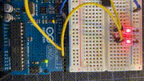
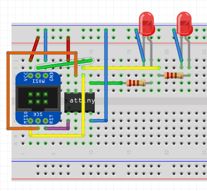
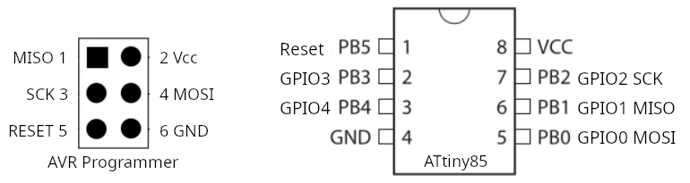
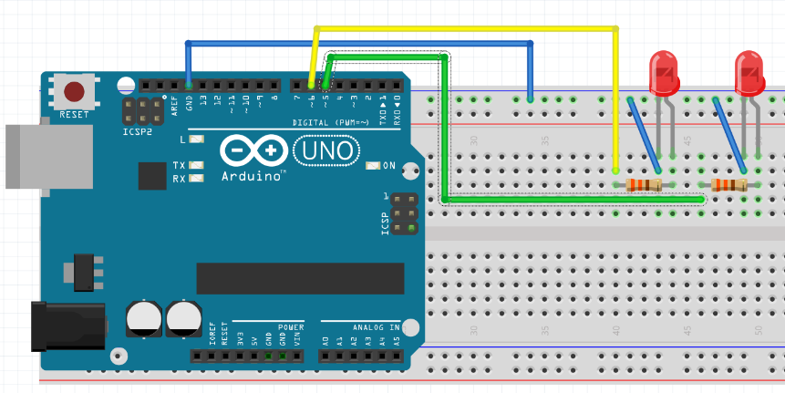
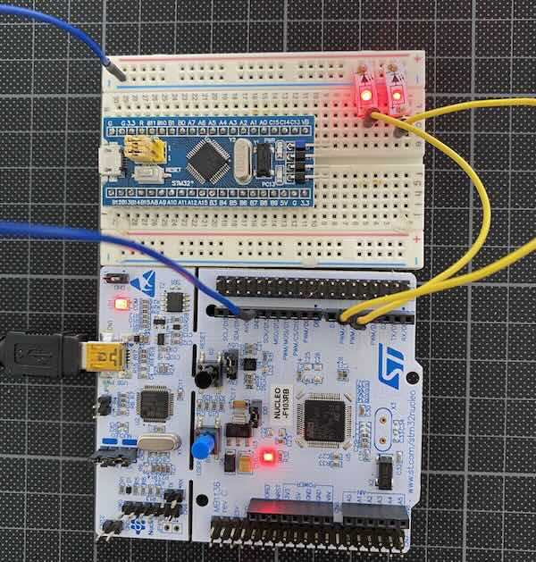
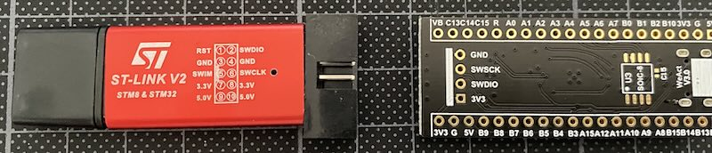

[](https://github.com/muwerk/example-blink/actions)

Led example
===========



A simple example demonstrating muwerk's scheduler and two blinking leds.

This showcases are very simple application of muwerk's [scheduler](https://github.com/muwerk/muwerk): let two leds blink and use the light mupplet
to animate two leds. Mupplets use the scheduler to execute driver functionality in the background, in our case
generating two different and phase-shifted led pulsating effects.

The project requires [`platformio`](https://platformio.org/) and will install the libraries [`ustd`](https://github.com/muwerk/ustd), [`muwerk`](https://github.com/muwerk/muwerk), and [`mupplet-core`](https://https://github.com/muwerk/mupplet-core) when building.

## Hardware setup

Required: your board (see `platformio.ini` for preconfigured boards), two leds and two resistors of $330\Omega$. `platformio.ini` contains definitions for `MB_LED1` and `MB_LED2` that specify the GPIO pin that is used for a given board. See below for specifics.

## Building with platformio

All examples are using the `platformio` command line tool `pio`, but it is also possible to build the projects with the 
[platformio vscode extension](https://marketplace.visualstudio.com/items?itemName=platformio.platformio-ide).

To build this projects for all boards and chipsset defined in `platformio.ini`, do:

```bash
pio run
```

After the build completes, it should show something like:

```
Environment    Status    Duration
-------------  --------  ------------
d1_mini        SUCCESS   00:00:03.117
esp32          SUCCESS   00:00:02.931
esp32c3        SUCCESS   00:00:02.341
protrinket3    SUCCESS   00:00:00.538
uno            SUCCESS   00:00:00.533
nano           SUCCESS   00:00:00.547
mega           SUCCESS   00:00:00.552
attiny         SUCCESS   00:00:00.396
bluepill       SUCCESS   00:00:02.002
blackpill_411  SUCCESS   00:00:02.330
blackpill_401  SUCCESS   00:00:02.247
maixbit        SUCCESS   00:00:01.216
featherm0      SUCCESS   00:00:00.981
nrf52          SUCCESS   00:00:01.842
==== 14 succeeded in 00:00:21.574 ===
```

You can select a specific board via `-e <environment>`, e.g. `pio run -e attiny` would only build
the variant for attiny. Additionally `platformio.ini` makes defines for each board which pin is
used for led 1 (`MB_LED1`) and led 2 (`MB_LED2`). Adapt those defines to your setup if necessary.

Check 'Platform specific notes' on how to build for a specific board and how to install the program.

## Platform specific notes



### ATtiny85

The ATtiny85 is a small AVR MCU with just 8k bytes of flash and 512 bytes of RAM. This tiny capacity is not enough
to run the `light` mupplet, since that supports lots of different effects and contains code for communication interfaces. Since the ATtiny is just a chip, and external programmer (e.g. AVRISPv2 or STK500v2) is required to program the chip. Check the diagrams on how to connect the programmer to the chip. The two leds are connected to GPIO 0 (chip pin 5) and GPIO1 (chip pin 6).

The code the the ATtiny works differently than all other boards, since it doesn't have enough resources to use the mupplet-core `light_processor`, so for ATtiny, we simply start a process that is executed every 100ms, and blinks two leds every 700ms and 1300ms respectively.

Review `platformio.ini` and make sure that programmer and port are correctly set, for ATtiny
both programmer and port _must_ be defined correctly in this file (not via command line options):



```
[env:attiny]
build_flags= -D __ATTINY__  -D MB_LED1=0 -D MB_LED2=1
platform=atmelavr
board=attiny85
framework=arduino
upload_protocol = avrispv2
upload_flags = -P/dev/ttyACM0 
```

Build and program with:

```
pio run -e attiny -t upload
```

### The Original Arduinos: Uno Rev 3, Nano, Mega, Adafruit Pro Trinket 3



The Arduino Uno Rev 3, Nano, and Pro Trinket 3 ([deprecated by Adafruit](https://www.adafruit.com/product/2010)) with their 32k Flash and 2k RAM are the smallest MCUs that actually can make use of multiple tasks and the light mupplet that creates two independent light effects on the two leds of this project.

Note for the Pro Tinket: according to Adafruit (see deprecation note above), the programming interface is unreliable with modern, faster computers. Best results were achieved by trying to program just after a reset of the chip.

The mega has more storage, but runs the same setup too.

Connect two leds via $330\Omega$ resistors to pin 5 and 6 (marked D5, D6 on the Nano). (Note: the internal led at pin 13 has no PWM support, so it can't show the wave effect. If you choose to use the internal led at pin 13, it will simply blink). Modify `platformio.ini`, definitions for `MB_LED1` and `MB_LED2` to change pins.

Build and run with:

```bash
# For uno
pio run -e uno -t upload
# For nano
pio run -e nano -t upload
# For mega
pio run -e mega -t upload
# For Adafruit Pro Trinket 3V (execute this just after a reset of the trinket)
pio run -e protrinket3 -t upload
```

### STM32 ARM cortex MCUs: various Bluepills and Blackpills

> **Note:** There are many, many variants of STM32 boards that are sometimes marketed
> under same or similar names while using different chip variants. If the `board`
> specification in `platformio.ini` is even slightly wrong, things **won't work**. The
> programming will work just fine, but internal hardware differences will prevent even
> led-blink examples from working!

#### ST Nucleo F103RB



The easiest way to start is with ST Nucleo boards: they have an STlink programmer build into the 
development board: the (removable) left side of the board is the programmer, and the right side 
is the MCU with Arduino Uno style connectors.

When using a different Nucleo board, be sure to adapt the `platformio.ini` definition 
`board = nucleo_f103rb`. The example uses pins D5 and D6 (see `platformio.ini`: `MB_LED1=D5 -D MB_LED2=D6`).

Connect the board via USB and programm with:

```bash
pio run -e nucleo_f103 -t upload
```

#### Bluepills and Blackpills


There are several different variants of 'blue-' and 'blackpill' STM32 boards available. They divide
into two major categories, 'blue': ST32F10x boards, based on Cortex M0 MCU and 'black' ST32F4xx boards based
on Cortex M4 cores. Once you get such a board check the imprint on the MCU chip to get the _precise_ name
of the chip used. Our example image shows a `STM32F103C8`. Use this together with 
[platformio's board list](https://docs.platformio.org/en/latest/boards/index.html#st-stm32) to identify
the `board` entry for `platformio.ini`.

Next step is the programmer. You'll need an STlink v2 programmer. Again there are hundreds of different clones
of this programmer type. While most of them seem to share a similar 2x4 pin connector, the connector layout
differs among the different clones! So make sure that you get a programmer that has at least a documented pin-layout:



From the blue- or blackpill connect the four vertical programmer connectors to your STlinkv2: `GND`, `SWSCK`, 
`SWDIO` and `3V3` need to be interconnected.

Then connect the USB-port of the STlinkv2 to your computer and program with:

```bash
# Bluepill STM32F103C8, Leds connected to A6, A7 (not all ports support PWM!)
pio run -e bluepill -t upload

```

## Documentation and References

* [muwerk scheduler and messaging](https://github.com/muwerk/muwerk)
* [munet networking and mqtt](https://github.com/muwerk/munet)
* [documentation of hardware mupplets and supported MQTT messages](https://github.com/muwerk/mupplet-core)
